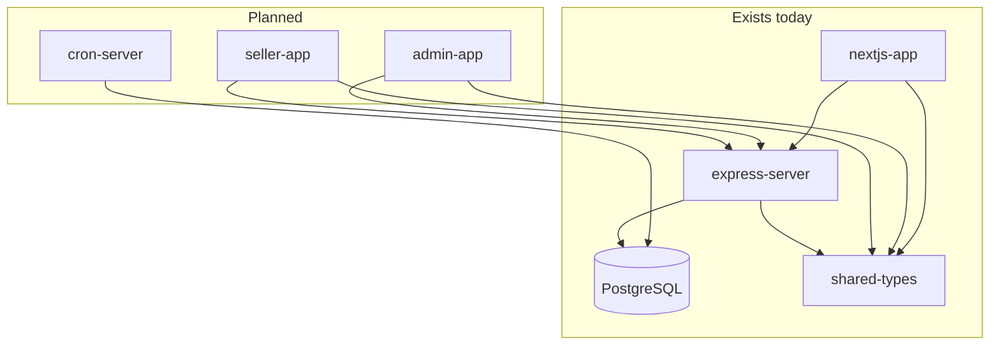

# SmurfElite Plans

Living documentation for the SmurfElite monorepo. Use these files to understand what exists today, what is missing, and how work is chunked for incremental delivery.

**Source requirements:** [prompt.md](../prompt.md)

---

## Quick navigation

| Document | Purpose |
| -------- | ------- |
| [feature-roadmap.md](./feature-roadmap.md) | Master phased todo list (~90 tasks across 9 phases) |
| [issues.md](./issues.md) | Prioritized bugs, gaps, and technical debt |
| [express-server.md](./express-server.md) | Backend API reference |
| [nextjs-app.md](./nextjs-app.md) | Buyer storefront reference |
| [admin-app.md](./admin-app.md) | Planned admin panel (not created yet) |
| [seller-app.md](./seller-app.md) | Planned seller portal (not created yet) |
| [cron-server.md](./cron-server.md) | Planned background jobs server |
| [shared-types.md](./shared-types.md) | Shared TypeScript types and Prisma client |

---

## Monorepo overview

```
Smurfelite-monorepo/
├── apps/
│   ├── express-server/     ✅ REST API + Prisma
│   ├── nextjs-app/         ✅ Buyer website
│   ├── admin-app/          ❌ Not created
│   ├── seller-app/         ❌ Not created
│   └── cron-server/        ❌ Not created
├── packages/
│   └── shared-types/       ✅ @smurfelite/types
└── plans/                  📋 This folder
```

### Dev commands (root)

| Command | Description |
| ------- | ----------- |
| `pnpm start:dev` | Express + Next.js in parallel |
| `pnpm dev:express` | API only |
| `pnpm dev:nextjs` | Buyer site only |
| `pnpm build` | Turbo build all workspaces |

---

## Architecture (current + planned)



---

## Development strategy

Work proceeds in **phases** defined in [feature-roadmap.md](./feature-roadmap.md):

1. **Phase 0** — Plans (this folder) ✅
2. **Phase 1** — Schema & shared foundations (ProductStatus, wallet, disputes, pgvector)
3. **Phase 2** — Payment bypass + order lifecycle (E2E unblock)
4. **Phase 3** — Email infrastructure
5. **Phase 4** — Buyer site polish (Tawk.to, disputes UI, real orders)
6. **Phase 5** — Express API completion
7. **Phase 6** — Seller app
8. **Phase 7** — Admin app
9. **Phase 8** — Cron server
10. **Phase 9** — NOWPayments hardening (deferred)

### Key decisions (from planning session)

| Topic | Decision |
| ----- | -------- |
| Admin / seller portals | Separate apps in monorepo (`apps/admin-app`, `apps/seller-app`) |
| Similar products | pgvector embeddings (future phase) |
| Payment during E2E | Payment bypass mode first; NOWPayments after full flow works |
| Livechat | Tawk.to embed widget |

---

## Feature status at a glance

| Area | Backend | Buyer UI | Admin UI | Seller UI |
| ---- | ------- | -------- | -------- | --------- |
| Products | Partial | Partial | — | — |
| Cart | Done | Done | — | — |
| Orders | Partial | Mock | — | — |
| Enquiry | Partial | Broken | — | — |
| Users | Partial | Partial | — | — |
| Auth | Partial | Done | — | — |
| Admin features | Missing | — | — | — |
| Email | Missing | — | — | — |
| Payment | Partial | Partial | — | — |
| Disputes | Missing | — | — | — |
| Wallet / payouts | Missing | — | — | — |
| Livechat | Missing | — | — | — |
| Cron jobs | Missing | — | — | — |

See [issues.md](./issues.md) for detailed problems and [feature-roadmap.md](./feature-roadmap.md) for the task checklist.

---

## How to use these docs

1. **Starting a task** — Find the phase in `feature-roadmap.md`, check off dependencies, read the relevant app summary.
2. **Debugging** — Search `issues.md` for known problems affecting your area.
3. **Onboarding** — Read app summaries (`express-server.md`, `nextjs-app.md`) before touching code.
4. **After completing work** — Update checkboxes in `feature-roadmap.md` and close/move items in `issues.md`.

---

## Related files

- [readMe.md](../readMe.md) — Repo setup, NOWPayments sandbox notes
- [apps/express-server/prisma/schema.prisma](../apps/express-server/prisma/schema.prisma) — Database schema (source of truth)
- [packages/shared-types/index.ts](../packages/shared-types/index.ts) — Shared API types
