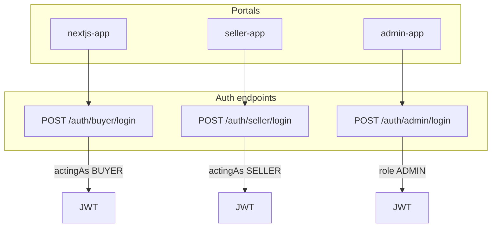

# SmurfElite Feature Roadmap

Master checklist for all features from [prompt.md](../prompt.md). Tasks are grouped into phases so independent modules ship before dependents.

**How to use:** Check off tasks as completed. Each task should map to a small, reviewable PR.

---

## Phase 0 — Documentation

- [x] Audit codebase vs prompt.md requirements
- [x] Create `plans/` folder structure
- [x] Write app summaries and issues tracker
- [x] Define phased roadmap (this file)

---

## Phase 1 — Schema & shared foundations

Prerequisite for wallet, disputes, product lifecycle, and vector search.

### 1.1 Prisma schema extensions

- [x] Add `ProductStatus` enum: `DRAFT`, `ACTIVE`, `PENDING_VERIFICATION`, `SOLD`, `DELISTED_BY_SELLER`, `BANNED_BY_ADMIN`
- [x] Add `status ProductStatus @default(DRAFT)` on `Product`
- [x] Add `sellerDelisted Boolean @default(false)` on `Product` (admin delist cascade)
- [x] Add `deletedAt DateTime?` for soft delete (optional, vs status-only)
- [x] Replace or supplement `isAvailable` with status-driven availability logic
- [x] Add `lastLoginAt DateTime?` on `User`
- [x] Add `GameCategory` model: `id`, `name`, `slug`, `isRestricted`, `createdAt`
- [x] Link `Product.gameType` to `GameCategory` (FK or validated slug) — migration strategy
- [x] Add `Dispute` model: order ref, buyer, seller, status, reason, details JSON, createdAt
- [x] Add `DisputeStatus` enum: `OPEN`, `UNDER_REVIEW`, `RESOLVED_BUYER`, `RESOLVED_SELLER`, `CLOSED`
- [x] Add `SellerWallet` model: `userId`, `pendingBalance`, `availableBalance`, `frozenBalance`
- [x] Add `WalletLedger` model: type, amount, orderId?, disputeId?, note, createdAt
- [x] Add `PaymentStatus` enum on Order or separate fields: `PENDING`, `PAID`, `FAILED`, `REFUNDED`
- [ ] Enable PostgreSQL `pgvector` extension in migration *(optional SQL: `migrations/optional_pgvector_embedding.sql` — requires pgvector on PostgreSQL host)*
- [ ] Add `embedding vector(1536)?` on `Product` *(deferred until pgvector extension installed)*
- [x] Run `prisma migrate dev` and regenerate client

### 1.2 Shared types

- [x] Export new enums from `@smurfelite/types`
- [x] Add DTOs: `GameCategoryResponse`, `DisputeResponse`, `WalletResponse`, `WalletLedgerEntry`
- [x] Add `ProductStatus` to `ProductListItem` / create/update requests
- [x] Document breaking changes in `plans/shared-types.md`

### 1.3 Express scaffolding (no full UI yet)

- [x] Create placeholder modules: `game-category/`, `dispute/`, `wallet/` (empty routes OK)
- [x] Update product listing filter to respect `ProductStatus.ACTIVE` + `!sellerDelisted`

**Depends on:** Nothing  
**Unblocks:** Phase 2, 5, 6, 7, 8

---

## Phase 2 — Payment bypass & order lifecycle (E2E unblock)

Priority: get full buyer journey working without NOWPayments.

### 2.1 Payment bypass

- [x] Add `PAYMENT_BYPASS` env var to `.env.example`
- [x] Create `payments/bypass/bypass.service.ts` — simulate payment success
- [x] Add `POST /payments/bypass/complete` (auth + owns order + PENDING only)
- [x] When bypass enabled, checkout calls bypass instead of NOWPayments invoice
- [x] Bypass flow: `PENDING → COMPLETED` with `paymentStatus: PAID` in one transaction

### 2.2 Order fulfillment

- [x] Create `orders/fulfillment.service.ts`
- [x] On completion: set order `COMPLETED`, products `SOLD` / unavailable
- [x] Release or finalize `transactionBlock` appropriately
- [x] Decrypt credentials and prepare email payload (purchase email on COMPLETED)
- [x] Write seller wallet `pendingBalance` credit on completion

### 2.3 Cart & checkout fixes

- [x] Do not clear Redux cart until payment/bypass success
- [x] Clear server cart items after successful order completion
- [x] Add `DELETE /cart` or clear-all helper endpoint
- [x] Cancel page: call cancel API when `orderId` query present and order is PENDING
- [x] Success page: poll order status until COMPLETED (bypass) or PROCESSING (real payment)

### 2.4 Orders UI wiring

- [ ] Replace mock data in `orders/page.tsx` with `useGetMyOrdersQuery`
- [ ] Map `OrderResponse` to orders table UI types
- [ ] Wire cancel order action to `PATCH /orders/:id/cancel`
- [ ] Show real status badges (PENDING, PROCESSING, COMPLETED, CANCELLED, REFUNDED)
- [ ] Add "View credentials" for COMPLETED orders (`GET /orders/:id/credentials`)

### 2.5 Order expiry (minimal — full cron in Phase 8)

- [x] Define `ORDER_PENDING_TIMEOUT_MINUTES` env default (e.g. 30)
- [x] Document manual cancel flow until cron exists
- [x] Optional: inline expiry check on order fetch

**Depends on:** Phase 1 (ProductStatus, wallet)  
**Unblocks:** Phase 4, 6, 7  
**Fixes issues:** ISS-002, ISS-003, ISS-004, ISS-005, ISS-006, ISS-011

---

## Phase 3 — Email infrastructure

### 3.1 SMTP module

- [x] Add `nodemailer` dependency
- [x] Create `services/email.service.ts` with shared SMTP transport
- [x] Env: `SMTP_HOST`, `SMTP_PORT` (shared server)
- [x] Env per sender: `EMAIL_*_ADDRESS`, `EMAIL_*_NAME`, `EMAIL_*_USER`, `EMAIL_*_PASS`
- [x] Helper: `sendEmail({ from: 'purchase' | 'help' | 'finance', to, subject, html })`

### 3.2 Wire transactional emails

- [x] Send verification email on register (help@)
- [x] Send password reset email (help@)
- [x] Send purchase credentials email on order COMPLETED (purchase@)
- [x] HTML templates for each email type

### 3.3 Enquiry fix

- [x] Decide: guest enquiry (extend schema) vs authenticated-only — **guest + optional auth link**
- [x] Align `EnquiryPayload`, Zod schema, Prisma model, Contact form
- [x] Store name/email/phone if guest flow chosen
- [x] Send notification email to help@ on new enquiry

**Depends on:** Phase 2 (fulfillment trigger)  
**Fixes issues:** ISS-001, ISS-009

---

## Phase 4 — Buyer site polish

### 4.1 Livechat

- [ ] Add Tawk.to property ID to env (`NEXT_PUBLIC_TAWK_PROPERTY_ID`)
- [ ] Embed script in `nextjs-app` root layout
- [ ] Verify widget loads on home, products, checkout

### 4.2 Disputes (buyer-facing)

- [x] API: `POST /disputes` with orderId + details
- [x] `GET /disputes/mine` for buyer/seller
- [x] Orders page: "Open dispute" action for COMPLETED orders
- [x] Dispute form with order + item details pre-filled

### 4.3 Product detail cleanup

- [x] Remove or clearly label mock reviews in `detail/data.ts`
- [x] Hide reviews panel until real review system exists (`PRODUCT_REVIEWS_ENABLED`)

### 4.4 Checkout UX

- [x] Decide fate of shipping step — **removed** for digital-only (ISS-012)
- [x] Payment method UI: show "Test mode" when bypass enabled
- [x] Error handling for unavailable products mid-checkout

**Depends on:** Phase 2, Phase 3 (partial), Phase 5 (dispute API)  
**Fixes issues:** ISS-012

---

## Phase 5 — Express API completion

### 5.1 Products

- [x] `POST /products` — default DRAFT; optional `publish: true` → ACTIVE (no admin approval)
- [x] `PATCH /products/:id/publish` — seller publishes draft → ACTIVE
- [x] Mark sold on fulfillment (automatic, Phase 2.2)
- [x] `PATCH /products/:id/delist` / `reactivate` — seller delist → DELISTED_BY_SELLER
- [x] `PATCH /products/:id/ban` / `lift-ban` — admin ban → BANNED_BY_ADMIN and restore
- [x] `DELETE /products/:id` — soft delete (`deletedAt`)
- [x] Filter public listing: ACTIVE + not seller-delisted + available + not deleted

### 5.2 Game categories (admin API)

- [x] CRUD `GET/POST/PATCH/DELETE /game-categories`
- [x] `PATCH /game-categories/:id/restrict` toggle
- [x] Block new listings in restricted categories

### 5.3 Seller delist / reactivate (admin API)

- [x] `PATCH /users/:id/delist` — set seller flag, cascade `sellerDelisted` on products
- [x] `PATCH /users/:id/reactivate` — clear flag, restore product visibility
- [x] Hide delisted seller products from public listing

### 5.4 Users (admin API)

- [x] `GET /users?search=&page=` — email/name search
- [x] `GET /users/:id` — detail with cart, orders, products, lastLoginAt
- [x] `GET /users/:id/products` — seller listings

### 5.5 Disputes (full API)

- [x] `POST /disputes` — buyer creates from order (Phase 4.2)
- [x] `GET /disputes/mine` — buyer/seller view (Phase 4.2)
- [x] `GET /disputes` — admin list with filters
- [x] `PATCH /disputes/:id/status` — admin resolve
- [x] On dispute open: freeze wallet amount linked to order

### 5.6 Wallet

- [x] Auto-create wallet on seller registration / first sale
- [x] Credit `pendingBalance` on order COMPLETED
- [x] Admin: `POST /wallets/:sellerId/payout` — move available → paid (manual record)
- [x] Admin: adjust frozen balance on dispute resolution
- [x] `GET /wallets/me` — seller balance read

### 5.7 Similar products (pgvector)

- [ ] Embedding text builder from title + description + specifications
- [ ] OpenAI/local embedding provider abstraction
- [ ] `POST /products/:id/embed` — generate/store embedding
- [ ] `GET /products/:id/similar` — vector similarity search
- [ ] Fallback to gameType filter if no embedding

### 5.8 Auth hardening

- [x] Remove public `role` from register schema; default BUYER only
- [x] Update `lastLoginAt` on login success
- [x] Seller registration flow via admin promote or dedicated endpoint *(superseded by Phase 10.5 — seller approval queue + self-apply)*

### 5.9 Payment status

- [x] Separate or map `PaymentStatus` alongside `OrderStatus`
- [x] IPN handlers update payment status (NOWPayments IPN + bypass fulfillment)

**Depends on:** Phase 1  
**Unblocks:** Phase 5.10, 6, 7, 8

---

## Phase 5.10 — Portal API (admin + seller apps)

Prerequisite endpoints before Vite portal UIs. See [seller-app.md](./seller-app.md) and [admin-app.md](./admin-app.md).

- [x] `GET /products/mine` — seller-owned products (all statuses, paginated)
- [x] `GET /products/admin` — all products for admin (no public-list filter)
- [x] `GET /orders/seller` — read-only sales lines for current seller
- [x] `GET /wallets/me/ledger` — seller ledger history
- [x] `GET /wallets` — admin paginated seller wallets
- [x] `GET /wallets/:sellerId` — admin single wallet
- [x] `GET /wallets/:sellerId/ledger` — admin ledger audit
- [x] Extend `GET /orders/:orderId/credentials` for `Role.ADMIN` (COMPLETED orders)
- [x] Shared types: `SellerProductListResponse`, `AdminProductListResponse`, `SellerSaleLine`, wallet list types
- [x] Smoke phase `5.10` + `smoke:through-5.10`
- [x] CORS: allow portal dev origins (`localhost:5173`, `5174`)

**Depends on:** Phase 5  
**Unblocks:** Phase 6, 7

---

## Phase 6 — Seller app (`apps/seller-app`)

**Stack:** Vite + React 19 + TypeScript + Tailwind + TanStack Router + TanStack Table + Redux Toolkit + RTK Query + redux-persist + `@smurfelite/ui` + `@smurfelite/types`.

**Decisions:** Self-publish only (no verification queue). No dashboard — post-login redirect to `/products`. Wallet read-only (no withdraw). Email + Google OAuth. Dev port `5174`.

### 6.1 Shared UI package

- [x] Create `packages/ui` — DataTable, AppShell, Button, Input, Badge, StatusBadge, ConfirmDialog, PageHeader, Tailwind preset
- [ ] (Optional defer) Migrate nextjs-app to `@smurfelite/ui`

### 6.2 Scaffold

- [x] Create `apps/seller-app` Vite workspace + turbo pipeline
- [x] RTK store + encrypted redux-persist (auth slice)
- [x] TanStack Router + role guard (`SELLER` only)
- [x] Env: `VITE_EXPRESS_SERVER_API`, `VITE_GOOGLE_CLIENT_ID`, `VITE_APP_NAME`

### 6.3 Auth & layout

- [x] `/login` — email/password + Google; reject non-SELLER roles
- [x] AppShell sidebar: Products, Sales, Wallet, Disputes (no dashboard)
- [x] `/` redirects to `/products`
- [x] Logout + token refresh (RTK baseApi)

### 6.4 Products

- [x] `/products` — list (`GET /products/mine`), status/search filters, publish/delist/reactivate/delete
- [x] `/products/new` — create form + optional publish immediately
- [x] `/products/:id/edit` — edit metadata; optional credential replace

### 6.5 Sales, wallet, disputes (read-only)

- [x] `/sales` — `GET /orders/seller`
- [x] `/wallet` — balances + `GET /wallets/me/ledger`
- [x] `/disputes` — `GET /disputes/mine` (read-only detail drawer)

**Depends on:** Phase 5.10, Phase 6.1  
**Out of scope:** Dashboard KPIs, seller withdraw, `PENDING_VERIFICATION` UI

---

## Phase 7 — Admin app (`apps/admin-app`)

**Stack:** Same as seller app. **Decisions:** ADMIN role only. No dashboard — redirect to `/users`. Order-only credential decrypt (not product-level). Dev port `5173`.

### 7.1 Scaffold

- [x] Create `apps/admin-app` Vite workspace (reuse ui + auth patterns from seller-app)
- [x] TanStack Router + `ADMIN` role gate
- [x] Root scripts: `pnpm dev:seller`, `pnpm dev:admin`

### 7.2 Auth & layout

- [x] `/login` — email/password + Google; reject non-ADMIN *(Google login superseded by Phase 10.6.1 — admin-only email login)*
- [x] AppShell: Users, Products, Orders, Enquiries, Disputes, Categories, Wallets
- [x] `/` redirects to `/users`

### 7.3 Users

- [x] `/users` — search + pagination (`GET /users`)
- [x] `/users/:userId` — detail, cart/orders; role change, promote-seller, delist/reactivate, delete

### 7.4 Catalog

- [x] `/products` — `GET /products/admin`, ban/lift-ban
- [x] `/products/:productId` — read-only metadata + ban actions
- [x] `/categories` — game category CRUD + restrict toggle

### 7.5 Operations

- [x] `/orders` + `/orders/:orderId` — list, status override, view credentials (COMPLETED)
- [x] `/enquiries` — list, close, delete
- [x] `/disputes` — list, resolve status
- [x] `/wallets` — seller balances, ledger, record payout

**Depends on:** Phase 5.10, Phase 6.1 (packages/ui)  
**Out of scope:** Dashboard KPIs, product approval queue, product credential decrypt, seller withdraw UI

---

## Phase 10 — Auth, admin governance & seller approval

Role-separated login APIs, admin provisioning (no promote-to-admin), seller approval before storefront listings, and `actingAs` JWT context so sellers can shop on the buyer site.

**Decisions:**

- Admins are created only in the admin panel (`POST /admins`); emailed a generated password. Buyer/seller emails cannot become admins.
- Sellers onboard via self-apply (seller portal) **or** admin invite; both start as `PENDING` until an admin approves.
- Sellers shopping on nextjs-app use `POST /auth/buyer/login` → JWT with `actingAs: BUYER` (DB `role` stays `SELLER`).
- Seller portal uses `POST /auth/seller/login` → `actingAs: SELLER`.
- Storefront listing visibility requires `sellerApprovalStatus === APPROVED` (user-level; `ProductStatus.PENDING_VERIFICATION` stays unused).

### 10.1 Prisma / enums

- [x] Add `SellerApprovalStatus` enum: `NONE`, `PENDING`, `APPROVED`, `REJECTED`
- [x] Add `sellerApprovalStatus` on `User` (default `NONE`; `PENDING` on apply/invite)
- [x] Add `sellerApprovedAt`, `sellerRejectedAt`, optional `sellerRejectionNote`
- [x] Add `adminInvitedAt` / `createdByAdminId` (optional audit for admin-created sellers/admins)
- [x] Migration + regenerate `@smurfelite/types` — `20260528120000_seller_approval_status`; backfill script for existing sellers
- [x] Document: `PENDING_VERIFICATION` on **Product** remains unused; seller gating is **user-level**, not product queue (see `plans/shared-types.md` § Phase 10.1)

### 10.2 JWT & middleware contracts

- [x] Extend access JWT payload: `{ id, role, actingAs? }` (`actingAs` required for buyer/seller portal logins)
- [x] Update `authenticate` / `authorize` to accept `actingAs` where routes are portal-scoped (e.g. cart/orders → `actingAs === BUYER`)
- [x] Refresh flow: re-issue access token preserving `actingAs` from refresh JWT or explicit `POST /auth/refresh` body
- [x] Export new types in `packages/shared-types/index.ts` (`AccessTokenClaims`, `RefreshTokenRequest/Response`)
- [x] Update smoke auth helpers — `phase-10_2.mts`, `loginWithActingAs` in `http.mts`

**Depends on:** Phase 1 (User model)  
**Unblocks:** 10.3–10.6

### 10.3 Separate login & password-reset APIs (Express)

#### 10.3.1 Role-scoped login (replace shared login for portals)

- [x] `POST /auth/buyer/login` — allow `role === BUYER` OR `role === SELLER`; issue `actingAs: BUYER`
- [x] `POST /auth/seller/login` — allow `role === SELLER` only; issue `actingAs: SELLER` (pending sellers may login to manage drafts)
- [x] `POST /auth/admin/login` — allow `role === ADMIN` only; no `actingAs`
- [x] Reject wrong portal with explicit errors (e.g. admin email on buyer login → 403, not generic 401)
- [x] `POST /auth/buyer/google` + `POST /auth/seller/google`; legacy `/auth/google` → buyer
- [x] Deprecation: `POST /auth/login` returns `Deprecation` header (410 after portal UI migration in 10.6–10.8)
- [x] Zod schemas + controllers in `auth.controller.ts` / `auth.routes.ts`

#### 10.3.2 Buyer password reset (existing, hardened)

- [x] `POST /auth/buyer/forgot-password` — only `BUYER`/`SELLER`; ignores `ADMIN`
- [x] `POST /auth/buyer/reset-password` — `purpose: BUYER`; `FRONTEND_URL/reset-password`
- [x] Legacy `/auth/forgot-password` + `/auth/reset-password` delegate to buyer + `Deprecation` header

#### 10.3.3 Admin password reset (new, isolated)

- [x] `POST /auth/admin/forgot-password` — `ADMIN` emails only
- [x] `POST /auth/admin/reset-password` — `ADMIN_FRONTEND_URL` / admin panel reset link
- [x] `buildAdminPasswordResetEmailHtml` + `sendAdminPasswordResetEmail`
- [x] `PasswordResetToken.purpose` enum isolates buyer vs admin reset tokens

#### 10.3.4 Register hardening

- [x] `POST /auth/register` — reject if email already used by `ADMIN` (`409 ADMIN_EMAIL_RESERVED`)
- [ ] Seller self-apply (10.5.1) — reject if email is `ADMIN`; define buyer → seller pending upgrade path

**Depends on:** 10.1–10.2  
**Unblocks:** portal UI phases

### 10.4 Admin provisioning & governance (API)

#### 10.4.1 Admin user CRUD (no promote-via-role)

- [x] `POST /admins` (admin-only) — create admin: email, name; auto-generate password; hash + save
- [x] Send transactional email with one-time password + admin login URL
- [x] `GET /admins` — paginated list (email, name, lastLoginAt, createdAt)
- [x] `DELETE /admins/:id` — remove admin (guard: cannot delete last admin; cannot self-delete without fallback)
- [x] `PATCH /admins/:id` — skipped (hard delete chosen; no deactivate endpoint)

#### 10.4.2 Email exclusivity rules

- [x] On `POST /admins`: reject if email exists with `role` in (`BUYER`, `SELLER`)
- [x] On buyer/seller register/apply: reject if email exists with `role === ADMIN` (register in 10.3; seller apply in 10.5)
- [x] Remove `ADMIN` from `updateRoleSchema` and `updateUserRole`

#### 10.4.3 Remove legacy promote-to-admin

- [x] Remove `ADMIN` option from admin-app user role dropdown (`UserDetailPage.tsx`)
- [x] Server: `updateUserRole` rejects `role: ADMIN` (admins only via `POST /admins`)
- [x] Update smoke tests that set role to ADMIN via `PATCH /users/:id/role`

**Depends on:** Phase 3 (email), 10.3  
**Unblocks:** 10.6

### 10.5 Seller approval & invite (API)

#### 10.5.1 Seller self-apply (seller portal)

- [x] `POST /auth/seller/apply` (or `/sellers/apply`) — create or upgrade user to `SELLER` + `sellerApprovalStatus: PENDING`
- [x] If existing `BUYER` with same email: upgrade to `SELLER` + `PENDING` (preserve buyer history)
- [x] Reject if email is `ADMIN`
- [x] Optional: require email verified before apply — deferred (no gate; verification email sent for new accounts)

#### 10.5.2 Admin-invited seller (admin panel)

- [x] `POST /sellers` (admin-only) — email, name; generated password; `PENDING`; email credentials (mirror admin invite)
- [x] `GET /sellers?status=PENDING|APPROVED|REJECTED` — approval queue
- [x] `PATCH /sellers/:id/approve` — set `APPROVED`, `sellerApprovedAt`
- [x] `PATCH /sellers/:id/reject` — set `REJECTED` + optional note

#### 10.5.3 Deprecate instant promote-seller

- [x] Remove `PATCH /users/:id/promote-seller` (hard delete; use apply / `POST /sellers`)
- [x] Block `PATCH /users/:id/role` with `role: SELLER`
- [x] Remove “Promote to seller” from `UserDetailPage.tsx`; link to `/sellers` for invites

#### 10.5.4 Listing gate (products on Next.js)

- [x] Extend `PUBLIC_LISTABLE_PRODUCT_WHERE`: `seller.sellerApprovalStatus === APPROVED`
- [x] `assertSellerCanList` — portal publish only (delist guard); public gate via `PUBLIC_LISTABLE_PRODUCT_WHERE`
- [x] Align `checkoutAvailability.ts` + `isProductPurchasable` + cart add guard with API
- [x] Smoke: unapproved seller `ACTIVE` product not returned by `GET /products`

**Depends on:** 10.1, 10.3  
**Unblocks:** 10.6–10.7

### 10.6 Admin app UI

#### 10.6.1 Auth cleanup

- [x] Remove Google OAuth from `main.tsx` and `LoginPage.tsx`
- [x] Remove `VITE_GOOGLE_CLIENT_ID` from `.env.example` and `plans/admin-app.md`
- [x] Point login to `POST /auth/admin/login` in `api/auth.ts`

#### 10.6.2 Admin management screen

- [x] New route `/admins` — list, add (email + name), remove
- [x] RTK endpoints: `GET/POST/DELETE /admins`
- [x] AppShell nav item “Admins”
- [x] Confirm dialogs for delete; surface API errors (email already buyer/seller)

#### 10.6.3 Admin password reset UI

- [x] `/forgot-password` + `/reset-password` pages (public routes)
- [x] Wire to `POST /auth/admin/forgot-password` and `POST /auth/admin/reset-password`
- [x] Link from login page

#### 10.6.4 Seller approval screen

- [x] New route `/sellers` — tabs or filters: Pending / Approved / Rejected
- [x] Actions: Approve, Reject (with note), Invite seller (form → `POST /sellers`)
- [x] Remove ADMIN from user role dropdown; remove promote-seller CTA

**Depends on:** 10.4, 10.5, 10.3  
**Updates:** `plans/admin-app.md`

### 10.7 Seller app UI

- [x] Login → `POST /auth/seller/login` (`seller-app/src/api/auth.ts`)
- [x] Registration / apply flow for non-sellers (`POST /auth/seller/apply`)
- [x] Post-login banner when `sellerApprovalStatus === PENDING` (“Awaiting admin approval — listings won’t appear on storefront”)
- [x] Optional: disable publish button until approved; fix publish success copy when not approved
- [x] Google OAuth: keep for seller (unchanged unless explicitly removed later)

**Depends on:** 10.3, 10.5

### 10.8 Next.js buyer app (dual-role sellers)

- [ ] Login/register → `POST /auth/buyer/login` / existing register path
- [ ] Store and send token with `actingAs: BUYER` in `baseApi.ts`
- [ ] Allow `SELLER` DB role to complete buyer journey (cart, checkout, orders) when `actingAs === BUYER`
- [ ] Implement missing `/reset-password` page (email links already point there)
- [ ] Forgot-password → `POST /auth/buyer/forgot-password` only
- [ ] UX: optional indicator when logged in as seller shopping as buyer (low priority)

**Depends on:** 10.2, 10.3

### 10.9 Route guards & security hardening

- [ ] Audit all `authorize([Role...])` usages: distinguish `role` vs `actingAs` (cart/orders/payments → buyer context)
- [ ] Seller portal routes: require `actingAs === SELLER` and `role === SELLER`
- [ ] Admin routes: unchanged `role === ADMIN`
- [ ] Reject cross-portal token reuse at middleware (seller `actingAs: SELLER` token on cart → 403)
- [ ] Update CORS if new public routes added
- [ ] Rate limits on new login/reset endpoints (mirror existing auth limiter)

**Depends on:** 10.2–10.8

### 10.10 Docs, smoke, cleanup

- [ ] New smoke phase `phase-10` (admin create, seller approve, listing visibility, split login, reset isolation)
- [ ] Update feature quick reference (this file) — done in Phase 10 rollout
- [ ] Update `plans/seller-app.md` onboarding diagram
- [ ] Update `plans/admin-app.md`: remove Google, add `/admins`, `/sellers`, reset pages
- [ ] `.env.example`: `ADMIN_FRONTEND_URL`; document `actingAs` in API docs if present
- [ ] Restrict `ensureAdminUser` dev seed to non-production only (document)

**Depends on:** 10.1–10.9  
**Requirement mapping:** (1) 10.6.1, (2) 10.4.1+10.6.2, (3) 10.4.1, (4) 10.3.3+10.6.3, (5) 10.4.3+10.6.4, (6) 10.4.2, (7) 10.3.1, (8) 10.2+10.3.1+10.8, (9) 10.5.4, (10) 10.5.2+10.6.4

**Suggested implementation order:** 10.1 → 10.2 → 10.3 → (10.4 ∥ 10.5) → 10.6 → (10.7 ∥ 10.8) → 10.9 → 10.10

---

## Phase 8 — Cron server (`apps/cron-server`)

### 8.1 Scaffold

- [x] Create `apps/cron-server` Node package
- [x] Share Prisma via `@smurfelite/types`
- [x] Env: `DATABASE_URL`, job intervals, hold period days

### 8.2 Jobs

- [x] **Wallet hold release:** move pending → available after N days
- [x] **Order expiry:** cancel PENDING orders past timeout; release `transactionBlock`
- [x] **Embedding backfill:** products missing embedding (optional, Phase 5 dependency)
- [x] Structured logging + error alerting hooks

### 8.3 Deployment

- [ ] Document run command: `pnpm --filter cron-server start`
- [ ] Single-instance lock (advisory lock or leader election) to prevent duplicate runs

**Depends on:** Phase 1 schema, Phase 5 wallet logic  
**Fixes issues:** ISS-007 (with Phase 2)

---

## Phase 9 — Payment gateway (deferred)

After E2E passes with bypass.

### 9.1 NOWPayments hardening

- [ ] Handle IPN: failed, expired, refunded statuses
- [ ] Map to `PaymentStatus` + order cancel where appropriate
- [ ] Payment retry UI on orders page for PENDING orders
- [ ] Separate `invoiceId` vs `paymentId` fields on Order

### 9.2 Production readiness

- [ ] Document ngrok-free dev workflow vs bypass
- [ ] Production env checklist
- [ ] Idempotency tests for IPN

### 9.3 PayPal cleanup (optional)

- [ ] Re-enable or remove PayPal code paths
- [ ] Remove unused RTK mutations if dropped

**Depends on:** Phase 2 E2E validated

---

## Feature area quick reference

Map prompt.md requirements to phases:

| # | Feature area | Primary phase |
| - | ------------ | ------------- |
| 1 | Products | 1, 5, 6 |
| 2 | Cart | 2 (fixes) |
| 3 | Orders | 2, 3, 5 |
| 4 | Enquiry | 3, 5, 7 |
| 5 | Users | 1, 5, 7, 10 |
| 6 | Authentication | 3, 5, 6, 7, **10** |
| 7 | Admin | 5, 5.10, 7, **10.4–10.6** |
| 7b | Seller portal | 5, 5.10, 6, **10.5–10.7** |
| 14 | Auth & role governance | **10** (admin provisioning, seller approval, split login) |
| 8 | Email | 3 |
| 9 | Payment | 2 (bypass), 9 (gateway) |
| 10 | Disputes | 1, 4, 5, 7 |
| 11 | Wallet & payouts | 1, 5, 6, 7, 8 |
| 12 | Livechat | 4 |
| 13 | Cron jobs | 8 |

---

## Suggested first implementation sprint

After Phase 0 (done), pick these for the first coding sprint:

1. Phase 1.1 — ProductStatus + wallet schema migration
2. Phase 2.1 — Payment bypass
3. Phase 2.2 — Fulfillment service
4. Phase 2.4 — Wire orders page
5. Phase 2.3 — Cart clearing fixes

This unlocks end-to-end buyer testing without external payment dependencies.

### Auth & role governance sprint (Phase 10)

After portal apps (Phases 6–7) are stable, pick these for a focused auth sprint:

1. Phase 10.1 — `SellerApprovalStatus` schema migration
2. Phase 10.2 — JWT `actingAs` + middleware
3. Phase 10.3 — Split login + isolated password-reset APIs
4. Phase 10.4 + 10.5 — Admin CRUD + seller approval APIs (parallel)
5. Phase 10.6 — Admin app (`/admins`, `/sellers`, remove Google, reset pages)
6. Phase 10.7 + 10.8 — Seller + Next.js portal wiring (parallel)
7. Phase 10.9 + 10.10 — Guards, smoke, docs
