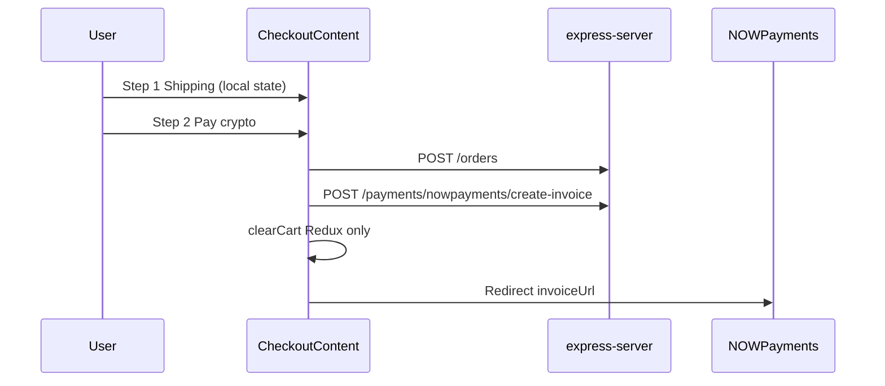

# nextjs-app

Buyer-facing storefront. Next.js 16 App Router + React 19 + Redux Toolkit + RTK Query.

**Path:** `apps/nextjs-app`  
**Package:** `nextjs-app`  
**Roadmap phases:** 2, 4 (primary); consumes APIs from Phase 5

---

## Purpose

- Browse and filter game account listings
- Product detail with similar accounts (gameType filter today)
- Cart management synced with API
- Checkout flow (shipping → payment)
- Order history UI (currently mock)
- Auth via modal (login/register/Google)
- Contact/enquiry form on homepage

---

## Folder map

```
apps/nextjs-app/
├── src/
│   ├── app/                    # App Router pages
│   │   ├── page.tsx            # Home
│   │   ├── products/
│   │   ├── cart/
│   │   ├── checkout/
│   │   ├── orders/
│   │   └── privacy-policy/
│   ├── api/                    # RTK Query endpoints
│   │   ├── baseApi.ts
│   │   ├── auth.ts
│   │   ├── products.ts
│   │   ├── cart.ts
│   │   ├── orders.ts
│   │   ├── payments.ts
│   │   ├── enquiries.ts
│   │   └── user.ts
│   ├── components/
│   │   ├── pages/              # Feature components
│   │   └── shared/             # Button, Carousel, Provider, etc.
│   ├── store/
│   │   └── reducers/           # auth, cart, user slices
│   ├── hooks/
│   └── lib/                    # checkoutSyntheticLines, addToCartFeedback
└── public/                     # Static assets
```

---

## Routes & pages

| Route | Type | Data source | Status |
| ----- | ---- | ----------- | ------ |
| `/` | SSR/Static | Static + Contact form | ✅ |
| `/products` | SSR | `fetch()` → `GET /products` | ✅ Real API |
| `/products/[productId]` | SSR | `GET /products/:id` + similar query | ✅ Real API |
| `/cart` | Client | RTK `useGetCartQuery` | ✅ Real API |
| `/checkout` | Client | Cart + order + payment mutations | ⚠️ Partial |
| `/checkout/[productId]` | Client | Buy-now scoped checkout | ⚠️ Partial |
| `/checkout/success` | Client | Polls order by query `orderId` | ⚠️ Partial |
| `/checkout/cancel` | Client | Cancel API when `orderId` present (PENDING) | ✅ |
| `/orders` | Client | RTK `useGetMyOrdersQuery` | ✅ Real API |
| `/orders/[orderId]` | Client | `useGetOrderByIdQuery` + actions | ✅ |
| `/orders/[orderId]/dispute` | Client | `useCreateDisputeMutation` (COMPLETED) | ✅ |
| `/privacy-policy` | Static | — | ✅ |

---

## API integration (RTK Query)

Base URL from `NEXT_PUBLIC_EXPRESS_SERVER_API` (see `baseApi.ts`).

| API file | Endpoints used | Wired in UI |
| -------- | -------------- | ----------- |
| `auth.ts` | buyer login/google/forgot/reset, register, logout | ✅ Login modal + `/forgot-password`, `/reset-password` |
| `products.ts` | list, getById, create, update, delete | ✅ Browse/detail; CRUD unused in UI |
| `cart.ts` | get, add, remove | ✅ Cart page, header badge |
| `orders.ts` | create, getMine, getById, cancel, credentials | ✅ Checkout, orders table, detail, credentials modal |
| `payments.ts` | nowpayments invoice, PayPal create/capture, bypass | ✅ Checkout crypto + PayPal |
| `enquiries.ts` | send, getMine | ⚠️ Contact form (broken payload) |
| `user.ts` | getMe, updateMe | ✅ Profile slice |

---

## State management

| Slice | Purpose |
| ----- | ------- |
| `auth` | isAuthenticated, tokens, `actingAs`, login modal |
| `cart` | Items synced from API on load/mutations |
| `user` | Profile from `GET /users/me` |

Redux persist with encryption for auth tokens.

---

## Checkout flow (current)



**Problems:**
- Shipping never sent to backend
- Cart cleared before payment confirmed
- Server cart not cleared on full-cart path
- No bypass mode for local E2E

**Planned (Phase 2):** Bypass path, deferred cart clear, wire cancel page.

---

## Mock / stub UI

| Location | What's mocked |
| -------- | --------------- |
| `components/pages/products/detail/data.ts` | Reviews, seller stats |
| `CheckoutOrderSummary.tsx` | Promo code (no backend) |
| `PaymentForm.tsx` | PayPal + crypto when configured; card, Skrill disabled |

---

## Auth UX

- Login/register modal in header; public `/forgot-password` and `/reset-password?token=...` (email reset links)
- Buyer portal: `POST /auth/buyer/login`, `POST /auth/buyer/google`, `POST /auth/buyer/forgot-password`, `POST /auth/buyer/reset-password`
- Register unchanged: `POST /auth/register` (new buyers); sellers use seller-app apply + buyer login here
- Redux `auth.actingAs` persisted (defaults to `BUYER` on login); refresh sends `{ actingAs: "BUYER" }` (see [express-server.md](./express-server.md) portal auth table)
- Google OAuth via `@react-oauth/google`
- Unauthenticated add-to-cart opens login modal
- Checkout requires auth (opens modal if not logged in)
- Dual-role: sellers can shop as buyers (`actingAs === BUYER`); `SellerShoppingBanner` when `role === SELLER` and buyer mode
- Admin emails on buyer login surface API error (e.g. `WRONG_BUYER_PORTAL`)

**Gaps:** No role-specific routing beyond buyer portal context. Seller/admin governance uses separate apps.

---

## Key components

| Component | Path | Notes |
| --------- | ---- | ----- |
| `ProductsGrid` | `components/pages/products/` | Pagination, add to cart |
| `FilterSidebar` | `components/pages/products/` | URL-driven filters |
| `ProductPurchaseCard` | `detail/` | Buy now + add to cart |
| `SimilarProducts` | `detail/` | Same gameType API query |
| `CartContent` | `components/pages/cart/` | Line items + summary |
| `CheckoutContent` | `components/pages/checkout/` | Main checkout orchestrator |
| `OrdersContent` | `components/pages/orders/` | Table + filters (live API); auth CTA when logged out |
| PENDING order actions | `OrderActionMenu`, `OrderDetailContent` | Pay with crypto / PayPal, cancel |
| `PayPalCheckoutButtons` | `components/pages/checkout/` | PayPal JS SDK after server create-order |
| `OrderCredentialsModal` | `components/pages/orders/` | COMPLETED orders — copy credentials |
| `OrderDetailContent` | `components/pages/orders/` | `/orders/[orderId]` summary + actions |
| `Contact` | `components/pages/home/` | Enquiry form |

---

## Environment variables

| Variable | Purpose |
| -------- | ------- |
| `NEXT_PUBLIC_EXPRESS_SERVER_API` | Client-side API base URL |
| `EXPRESS_SERVER_API` | Server-side fetch (products SSR) |

**Planned:**
- `NEXT_PUBLIC_TAWK_PROPERTY_ID` — livechat (Phase 4)
- `NEXT_PUBLIC_PAYMENT_BYPASS` — optional UI hint

---

## Scripts

```bash
pnpm --filter=nextjs-app dev
pnpm --filter=nextjs-app build
```

---

## Planned work (this app)

### Phase 2
- [x] Wire orders page to real API (Phase 2.4)
- [ ] Fix checkout cart timing
- [ ] Payment bypass integration
- [x] Cancel page → cancel order API

### Phase 4
- [ ] Tawk.to script in layout
- [x] Dispute form from orders page
- [x] Credentials viewer for completed orders (Phase 2.4 modal)
- [x] Remove mock reviews (Phase 4.3 — `PRODUCT_REVIEWS_ENABLED`)

---

## Dependencies

- `@smurfelite/types` — shared interfaces
- `express-server` — all data via REST

---

## Related docs

- [express-server.md](./express-server.md) — API reference
- [feature-roadmap.md](./feature-roadmap.md) — Phases 2, 4
- [issues.md](./issues.md) — ISS-001 through ISS-013
