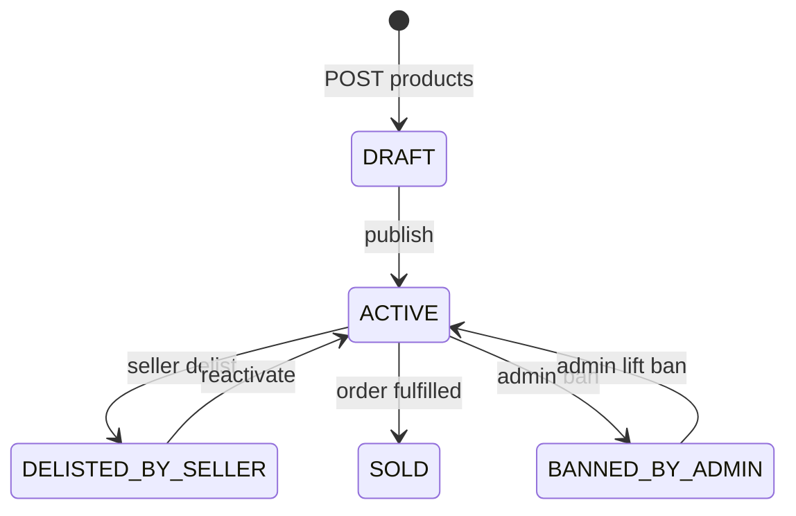

# seller-app

Seller portal for listing and managing game accounts.

**Path:** `apps/seller-app`  
**Roadmap:** Phase 6  
**Stack:** Vite + React 19 + TypeScript + Tailwind + TanStack Router + TanStack Table + Redux Toolkit + RTK Query + redux-persist + `@smurfelite/ui`

---

## Purpose

- Sellers manage product listings (create, edit, publish, delist)
- Read-only sales, wallet balances, and disputes
- No dashboard in v1 — default route is `/products`
- Payouts are manual by admin — wallet is read-only (no withdraw button)

---

## Access control

- All routes except `/login` require `Role.SELLER` JWT
- BUYER/ADMIN tokens: logout + toast (“Seller account required. Contact support.”)
- Product mutations scoped to `sellerId === currentUser.id` (API + `verifySeller`)

**Onboarding:** User registers as BUYER on nextjs-app → admin promotes via `PATCH /users/:id/promote-seller` → seller logs in here.

---

## Tech stack

| Layer | Choice |
| ----- | ------ |
| Build | Vite 6 + `@vitejs/plugin-react` |
| Router | `@tanstack/react-router` |
| Tables | `@tanstack/react-table` via `@smurfelite/ui` |
| State | RTK + RTK Query + redux-persist (encrypted auth) |
| OAuth | `@react-oauth/google` → `POST /auth/google` |
| Types | `@smurfelite/types` |

**Dev port:** `5174` (`pnpm dev:seller`)

---

## Environment variables

| Variable | Purpose |
| -------- | ------- |
| `VITE_EXPRESS_SERVER_API` | API base, e.g. `http://localhost:8080/api` |
| `VITE_GOOGLE_CLIENT_ID` | Google OAuth client ID |
| `VITE_APP_NAME` | Branding in shell header |

---

## Folder structure

```
apps/seller-app/
├── src/
│   ├── routes/                 # TanStack Router file routes
│   │   ├── __root.tsx
│   │   ├── login.tsx
│   │   ├── _authenticated.tsx
│   │   ├── _authenticated/products/
│   │   ├── _authenticated/products/new.tsx
│   │   ├── _authenticated/products/$id.edit.tsx
│   │   ├── _authenticated/sales.tsx
│   │   ├── _authenticated/wallet.tsx
│   │   └── _authenticated/disputes.tsx
│   ├── api/                    # RTK Query injectEndpoints
│   ├── store/
│   └── main.tsx
├── index.html
└── package.json
```

---

## Routes & features

| Route | Features | API |
| ----- | -------- | --- |
| `/` | Redirect → `/products` | — |
| `/login` | Email/password + Google; SELLER gate | `/auth/login`, `/auth/google` |
| `/products` | Table, status/search filters, publish/delist/reactivate/delete | `GET /products/mine` |
| `/products/new` | Create form, publish immediately checkbox | `POST /products`, `GET /game-categories` |
| `/products/:id/edit` | Edit metadata; optional credential replace | `GET/PUT /products/:id` |
| `/sales` | Read-only sales table + detail drawer | `GET /orders/seller` |
| `/wallet` | Balance cards + ledger table | `GET /wallets/me`, `GET /wallets/me/ledger` |
| `/disputes` | Read-only list + detail drawer | `GET /disputes/mine` |

**Sidebar nav:** Products, Sales, Wallet, Disputes, Logout.

---

## Product status workflow (seller view)



No `PENDING_VERIFICATION` UI — self-publish only (Phase 5.1).

---

## Product form fields

Aligned with `CreateProductRequest`:

- Game category (non-restricted categories only)
- Title, description, price
- Specifications (key/value → JSON)
- Image URL
- Account credentials (required on create; never shown again after save)
- Optional: publish immediately (`publish: true`)

---

## API dependencies

| Endpoint | Phase |
| -------- | ----- |
| `POST /products`, `PUT /products/:id`, `PATCH` publish/delist/reactivate, `DELETE` | 5.1 ✅ |
| `GET /products/mine` | 5.10 |
| `GET /orders/seller` | 5.10 |
| `GET /wallets/me`, `GET /wallets/me/ledger` | 5.6, 5.10 |
| `GET /disputes/mine` | 5.5 ✅ |
| `GET /game-categories` | 5.2 ✅ |

---

## Out of scope (v1)

- Dashboard / KPI home page
- Seller withdraw or payout requests
- `PENDING_VERIFICATION` submission
- S3 image upload (URL string only)
- E2E Playwright (API smoke covers backend)

---

## Related docs

- [admin-app.md](./admin-app.md) — promotes sellers, records payouts
- [feature-roadmap.md](./feature-roadmap.md) — Phase 6 checklist
- [express-server.md](./express-server.md) — API reference
