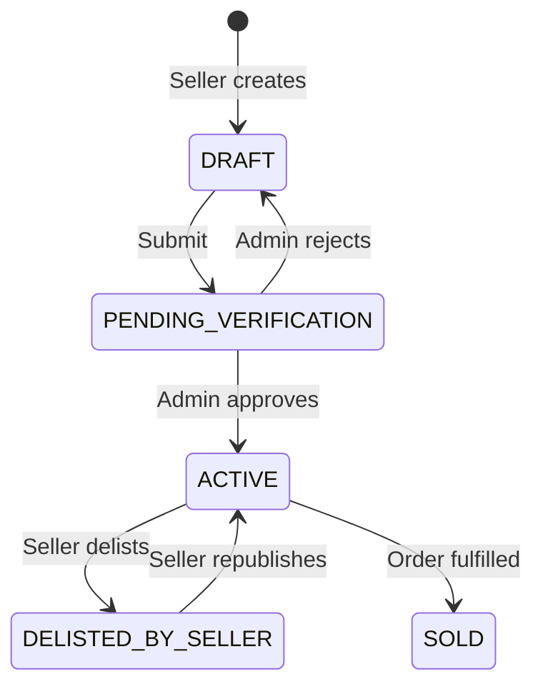

# seller-app (planned)

Seller portal for listing and managing game accounts. **Not created yet.**

**Planned path:** `apps/seller-app`  
**Roadmap phase:** 6  
**Architecture decision:** Separate Next.js app in monorepo

---

## Purpose

- Sellers log in and manage their product listings
- Create/edit listings with account credentials (encrypted server-side)
- Track listing status (draft → verification → active → sold)
- View wallet balances (pending, available, frozen)
- Read-only view of disputes affecting their sales

---

## Access control

- All routes require `Role.SELLER` JWT
- BUYER/ADMIN tokens rejected at login
- Product mutations scoped to `sellerId === currentUser.id` (enforced by API + `verifySeller` middleware)

---

## Planned folder structure

```
apps/seller-app/
├── src/
│   ├── app/
│   │   ├── login/
│   │   ├── (dashboard)/
│   │   │   ├── page.tsx              # Overview stats
│   │   │   ├── products/
│   │   │   │   ├── page.tsx          # My listings
│   │   │   │   ├── new/page.tsx      # Create listing
│   │   │   │   └── [id]/edit/page.tsx
│   │   │   ├── sales/                # Orders containing my products
│   │   │   ├── wallet/
│   │   │   └── disputes/
│   │   └── layout.tsx
│   ├── api/
│   └── components/
│       ├── layout/
│       └── products/                 # Forms for credentials, specs, images
└── package.json
```

---

## Planned screens

### Dashboard (`/`)

- Active listings count
- Pending verification count
- Recent sales (items sold from my products)
- Wallet summary: pending / available / frozen
- **API deps:** seller stats endpoint (Phase 5), `GET /wallets/me`

### Products (`/products`)

| Screen | Features | API |
| ------ | -------- | --- |
| List | Filter by ProductStatus, search title | `GET /products/mine` (new) |
| Create | gameType, title, description, price, specs, image, credentials | `POST /products` ✅ |
| Edit | Update fields, delist own product | `PUT /products/:id` ✅ |
| Actions | Submit for verification, delist | New status endpoints (Phase 5) |

### Create / edit product form fields

Aligned with `CreateProductRequest` in shared-types:

- Game category (dropdown from `GET /game-categories` — non-restricted only)
- Title, description, price
- Specifications (key/value JSON builder)
- Image URL upload (future: S3; now URL string)
- Account credentials (username, password, email, email password) — sent once, never shown again after save

### Sales (`/sales`)

| Feature | API (Phase 5) |
| ------- | ------------- |
| List order items for my products | `GET /seller/sales` or filter on orders |
| View buyer-facing item status | Read-only |

Payouts are **manual by admin** — seller app shows balance only, no withdraw button (per prompt.md).

### Wallet (`/wallet`)

| Feature | API (Phase 5) |
| ------- | ------------- |
| Pending balance | `GET /wallets/me` |
| Available to withdraw | same |
| Frozen (disputes) | same |
| Ledger history | `GET /wallets/me/ledger` |

### Disputes (`/disputes`)

| Feature | API (Phase 5) |
| ------- | ------------- |
| List disputes on my sales | `GET /disputes/mine` (seller filter) |
| View details | Read-only |

---

## Product status workflow (seller view)



Admin can also set `BANNED_BY_ADMIN` (seller read-only view).

---

## Tech stack (recommended)

Same as admin-app / nextjs-app:

- Next.js 16, TypeScript, Tailwind
- RTK Query + Redux
- `@smurfelite/types`
- react-hook-form for product forms
- Dev port e.g. `3002`

---

## Scaffold checklist (Phase 6.1)

- [ ] Create workspace `apps/seller-app`
- [ ] Turbo + pnpm workspace config
- [ ] SELLER role guard
- [ ] Login page
- [ ] Copy RTK baseApi pattern
- [ ] Product create form (first vertical slice)

---

## API dependencies

| Priority | Endpoint | Exists today |
| -------- | -------- | ------------ |
| P0 | `POST /products` | ✅ |
| P0 | `PUT /products/:id` | ✅ |
| P0 | `DELETE /products/:id` | ✅ |
| P0 | `GET /products/mine` | ❌ Need seller-scoped list |
| P1 | Product status transitions | ❌ Phase 5 |
| P1 | `GET /wallets/me` | ❌ Phase 5 |
| P1 | `GET /game-categories` (public list) | ❌ Phase 5 |
| P2 | Seller sales / disputes | ❌ Phase 5 |

Existing `verifySeller` middleware in express-server ensures sellers only mutate own products.

---

## Seller onboarding flow (planned)

1. User registers as BUYER on nextjs-app (or dedicated signup)
2. Admin promotes to SELLER via admin-app (`PATCH /users/:id/role`)
3. Seller logs into seller-app
4. Wallet auto-created on first login or first listing (Phase 5)

**Security note:** Remove public `role: SELLER` from register API (ISS-010).

---

## Environment variables

| Variable | Purpose |
| -------- | ------- |
| `NEXT_PUBLIC_EXPRESS_SERVER_API` | API base URL |

---

## Related docs

- [express-server.md](./express-server.md) — product + auth modules
- [admin-app.md](./admin-app.md) — admin promotes sellers, handles payouts
- [feature-roadmap.md](./feature-roadmap.md) — Phase 6 tasks
