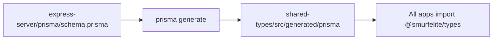

# shared-types

Shared TypeScript types and generated Prisma client for the SmurfElite monorepo.

**Path:** `packages/shared-types`  
**Package name:** `@smurfelite/types`  
**Roadmap phases:** 1 (extensions), ongoing with every schema change

---

## Purpose

- Single source of API contract types consumed by all apps
- Re-export Prisma generated client/enums from one package
- Avoid duplicating interfaces between express-server, nextjs-app, admin-app, seller-app, cron-server

---

## Folder map

```
packages/shared-types/
├── index.ts                    # Main exports (hand-written DTOs + re-exports)
├── pricing.ts                  # ORDER_SERVICE_FEE_USD
├── package.json
└── src/generated/prisma/       # Generated by Prisma (do not edit manually)
    ├── index.js
    ├── index.d.ts
    ├── schema.prisma           # Copy/sync from express-server
    └── client.js
```

---

## Prisma generation flow



**Commands:**

```bash
# From express-server (primary)
pnpm --filter=@smurfelite/express-server prisma:generate

# Or via shared-types build script
pnpm --filter=@smurfelite/types build
```

**Generator config** (in schema.prisma):

```prisma
generator client {
  provider = "prisma-client-js"
  output   = "../../../packages/shared-types/src/generated/prisma"
}
```

Only express-server owns migrations (`prisma migrate dev`). All apps consume the generated client.

---

## Current exports (`index.ts`)

### Re-exported from Prisma

- `Role`, `OrderStatus`, `SellerApprovalStatus`, `User`, and all model types
- Full `@smurfelite/types` re-exports `./src/generated/prisma/index`

### Hand-written DTOs

| Domain | Types |
| ------ | ----- |
| Auth | `LoginRequest`, `LoginResponse`, `RegisterRequest`, `GoogleOAuthResponse`, etc. |
| User | `UserProfileResponse`, `UpdateUserRequest`, `ChangePasswordRequest` |
| Products | `ProductFilters`, `ProductListItem`, `ProductListResponse`, `CreateProductRequest`, `UpdateProductRequest` |
| Cart | `CartResponse`, `CartItemResponse`, `CartProductSummary` |
| Orders | `CreateOrderRequest`, `OrderResponse`, `OrderItemResponse`, `OrderCredentialsResponse` |
| Payments | PayPal + NOWPayments request/response types |
| Enquiry | `EnquiryPayload`, `EnquiryResponse` |

### Pricing

```typescript
export { ORDER_SERVICE_FEE_USD } from "./pricing";  // currently 0
```

Duplicated constant also in `apps/express-server/src/constants/order-pricing.ts` — keep in sync.

---

## Phase 1 breaking changes (2026-05-27)

| Change | Impact |
| ------ | ------ |
| `ProductListItem.status`, `sellerDelisted`, `gameCategoryId` | API list/detail responses include new fields |
| `OrderResponse.paymentStatus` | All order responses include payment status (default `PENDING`) |
| `UserProfileResponse.lastLoginAt` | Set on email/password login |
| New Prisma models | `GameCategory`, `Dispute`, `SellerWallet`, `WalletLedger` — no public CRUD yet (501 placeholders) |

Regenerate client after schema changes: `pnpm --filter=@smurfelite/express-server prisma:generate`

---

## Consumers

| App | Import examples |
| --- | --------------- |
| express-server | `Role`, `OrderStatus` via `#prisma` alias + shared DTOs |
| nextjs-app | `ProductListItem`, `CartItemResponse`, `OrderResponse` |
| admin-app (planned) | All admin DTOs |
| seller-app (planned) | Product create/update types |
| cron-server (planned) | Prisma client, enums |

**Workspace dependency:**

```json
"@smurfelite/types": "workspace:^1.0.0"
```

---

## Types to add (Phase 1+)

### Phase 1 — Schema alignment (done)

- [x] `ProductStatus` enum (re-export from Prisma)
- [x] `DisputeStatus`, `PaymentStatus`, `WalletLedgerType` enums
- [x] `GameCategoryResponse`, `CreateGameCategoryRequest`
- [x] `DisputeResponse`, `CreateDisputeRequest`
- [x] `WalletResponse`, `WalletLedgerEntry`
- [x] `ProductListItem` includes `status`, `sellerDelisted`, `gameCategoryId`
- [x] `OrderResponse` includes `paymentStatus`
- [x] `UserProfileResponse` includes `lastLoginAt`

### Phase 10.1 — Seller approval (2026-05-28)

- [x] `SellerApprovalStatus` enum: `NONE`, `PENDING`, `APPROVED`, `REJECTED`
- [x] `User.sellerApprovalStatus`, `sellerApprovedAt`, `sellerRejectedAt`, `sellerRejectionNote`
- [x] `User.adminInvitedAt`, `createdByAdminId` (+ self-relation `createdByAdmin`)
- [x] Migration: `prisma/migrations/20260528120000_seller_approval_status`
- [x] Backfill: existing `SELLER` users → `APPROVED` (`scripts/backfill-seller-approval.mts`)

**Note:** `ProductStatus.PENDING_VERIFICATION` is **not** used for seller onboarding. Storefront gating in Phase 10.5 uses `User.sellerApprovalStatus === APPROVED`.

### pgvector (deferred)

- [ ] `embedding vector(1536)` on Product — run `prisma/migrations/optional_pgvector_embedding.sql` when PostgreSQL has pgvector installed

### Phase 2 — Payment bypass

- [ ] `BypassPaymentRequest` `{ internalOrderId: string }`
- [ ] `BypassPaymentResponse` `{ order: OrderResponse }`

### Phase 5.10 — Portal API (admin + seller apps)

- [x] `PaginationMeta` + list response shapes
- [x] `AdminProductListItem` / `AdminProductListResponse` — `GET /products/admin`
- [x] `SellerSaleLine` / `SellerSalesResponse` — `GET /orders/seller`
- [x] `WalletLedgerListResponse` — ledger pagination
- [x] `AdminWalletListItem` / `AdminWalletListResponse` — `GET /wallets`
- [x] `RecordPayoutRequest` — `POST /wallets/:sellerId/payout`
- [x] `OrderCredentialsResponse` — admin `GET /orders/:id/credentials`

### Phase 5 — Extended API (other)

- [x] `UserDetailResponse` (cart, orders, products, lastLoginAt) — via admin user detail
- [ ] `SimilarProductsResponse` (pgvector)

### Phase 3 — Enquiry fix

- [x] Align `EnquiryPayload` with backend schema (see ISS-001)
- [x] Guest fields on Enquiry model + optional `userId`

---

## Enquiry types (Phase 3.3)

**`EnquiryPayload` (frontend + API):**
```typescript
{ name, email, phone?, message }
```

**Backend stores:** auto-generated `subject`, guest contact fields, optional `userId` when logged in.

---

## Package.json exports map

```json
{
  "exports": {
    ".": "./index.ts",
    "./pricing": "./pricing.ts"
  }
}
```

Apps import primarily from `@smurfelite/types`. Prisma internals accessed via main export.

---

## Conventions for new types

1. Add hand-written interfaces to `index.ts` grouped by domain (match existing comment blocks)
2. Prefer re-exporting Prisma enums after schema changes rather than duplicating
3. Use `string` for ISO dates in API responses (JSON serialization)
4. Optional fields marked with `?`
5. Document breaking changes in PR + update app summaries in `plans/`

---

## Breaking change checklist

When modifying types:

- [ ] Run `prisma generate` after schema migration
- [ ] Fix TypeScript errors in express-server
- [ ] Fix TypeScript errors in nextjs-app
- [ ] Update RTK Query endpoint types if response shape changed
- [ ] Note in `plans/issues.md` if fixing a known mismatch

---

## Related docs

- [express-server.md](./express-server.md) — schema owner
- [feature-roadmap.md](./feature-roadmap.md) — Phase 1.2 tasks
- [issues.md](./issues.md) — ISS-001 (EnquiryPayload)
