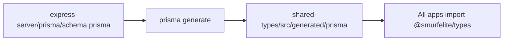

# shared-types

Shared TypeScript types and generated Prisma client for the SmurfElite monorepo.

**Path:** `packages/shared-types`  
**Package name:** `@smurfelite/types`  
**Roadmap phases:** 1 (extensions), ongoing with every schema change

---

## Purpose

- Single source of API contract types consumed by all apps
- Re-export Prisma generated client/enums from one package
- Avoid duplicating interfaces between express-server, nextjs-app, admin-app, seller-app, cron-server

---

## Folder map

```
packages/shared-types/
├── index.ts                    # Main exports (hand-written DTOs + re-exports)
├── pricing.ts                  # ORDER_SERVICE_FEE_USD
├── package.json
└── src/generated/prisma/       # Generated by Prisma (do not edit manually)
    ├── index.js
    ├── index.d.ts
    ├── schema.prisma           # Copy/sync from express-server
    └── client.js
```

---

## Prisma generation flow



**Commands:**

```bash
# From express-server (primary)
pnpm --filter=@smurfelite/express-server prisma:generate

# Or via shared-types build script
pnpm --filter=@smurfelite/types build
```

**Generator config** (in schema.prisma):

```prisma
generator client {
  provider = "prisma-client-js"
  output   = "../../../packages/shared-types/src/generated/prisma"
}
```

Only express-server owns migrations (`prisma migrate dev`). All apps consume the generated client.

---

## Current exports (`index.ts`)

### Re-exported from Prisma

- `Role`, `OrderStatus`, `User`, and all model types
- Full `@smurfelite/types` re-exports `./src/generated/prisma/index`

### Hand-written DTOs

| Domain | Types |
| ------ | ----- |
| Auth | `LoginRequest`, `LoginResponse`, `RegisterRequest`, `GoogleOAuthResponse`, etc. |
| User | `UserProfileResponse`, `UpdateUserRequest`, `ChangePasswordRequest` |
| Products | `ProductFilters`, `ProductListItem`, `ProductListResponse`, `CreateProductRequest`, `UpdateProductRequest` |
| Cart | `CartResponse`, `CartItemResponse`, `CartProductSummary` |
| Orders | `CreateOrderRequest`, `OrderResponse`, `OrderItemResponse`, `OrderCredentialsResponse` |
| Payments | PayPal + NOWPayments request/response types |
| Enquiry | `EnquiryPayload`, `EnquiryResponse` |

### Pricing

```typescript
export { ORDER_SERVICE_FEE_USD } from "./pricing";  // currently 0
```

Duplicated constant also in `apps/express-server/src/constants/order-pricing.ts` — keep in sync.

---

## Consumers

| App | Import examples |
| --- | --------------- |
| express-server | `Role`, `OrderStatus` via `#prisma` alias + shared DTOs |
| nextjs-app | `ProductListItem`, `CartItemResponse`, `OrderResponse` |
| admin-app (planned) | All admin DTOs |
| seller-app (planned) | Product create/update types |
| cron-server (planned) | Prisma client, enums |

**Workspace dependency:**

```json
"@smurfelite/types": "workspace:^1.0.0"
```

---

## Types to add (Phase 1+)

### Phase 1 — Schema alignment

- [ ] `ProductStatus` enum (re-export from Prisma after migration)
- [ ] `DisputeStatus` enum
- [ ] `PaymentStatus` enum
- [ ] `GameCategoryResponse`, `CreateGameCategoryRequest`
- [ ] `DisputeResponse`, `CreateDisputeRequest`
- [ ] `WalletResponse`, `WalletLedgerEntry`
- [ ] Update `ProductListItem` with `status`, `sellerDelisted`

### Phase 2 — Payment bypass

- [ ] `BypassPaymentRequest` `{ internalOrderId: string }`
- [ ] `BypassPaymentResponse` `{ order: OrderResponse }`

### Phase 5 — Extended API

- [ ] `UserDetailResponse` (cart, orders, products, lastLoginAt)
- [ ] `SellerSalesResponse`
- [ ] `SimilarProductsResponse`
- [ ] Admin payout request types

### Phase 3 — Enquiry fix

- [ ] Align `EnquiryPayload` with backend schema (see ISS-001)
- [ ] Either add guest fields to response or simplify payload

---

## Enquiry type mismatch (current bug)

**Frontend `EnquiryPayload`:**
```typescript
{ message, name, email, phone }
```

**Backend expects:**
```typescript
{ subject, message }
```

Fix in Phase 3 — update both `index.ts` and express Zod schema together.

---

## Package.json exports map

```json
{
  "exports": {
    ".": "./index.ts",
    "./pricing": "./pricing.ts"
  }
}
```

Apps import primarily from `@smurfelite/types`. Prisma internals accessed via main export.

---

## Conventions for new types

1. Add hand-written interfaces to `index.ts` grouped by domain (match existing comment blocks)
2. Prefer re-exporting Prisma enums after schema changes rather than duplicating
3. Use `string` for ISO dates in API responses (JSON serialization)
4. Optional fields marked with `?`
5. Document breaking changes in PR + update app summaries in `plans/`

---

## Breaking change checklist

When modifying types:

- [ ] Run `prisma generate` after schema migration
- [ ] Fix TypeScript errors in express-server
- [ ] Fix TypeScript errors in nextjs-app
- [ ] Update RTK Query endpoint types if response shape changed
- [ ] Note in `plans/issues.md` if fixing a known mismatch

---

## Related docs

- [express-server.md](./express-server.md) — schema owner
- [feature-roadmap.md](./feature-roadmap.md) — Phase 1.2 tasks
- [issues.md](./issues.md) — ISS-001 (EnquiryPayload)
